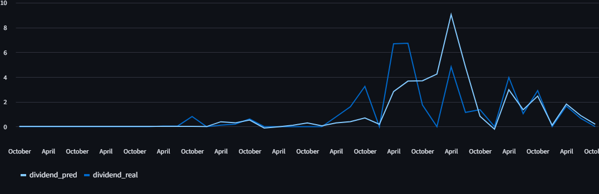

# Case Study: Previsor de Dividendos

## 1. Introdução
O objetivo deste estudo é analisar o histórico de dividendos de ações e demonstrar as previsões trimestrais geradas pelo modelo **Previsor de Dividendos**.  
Os dados utilizados foram obtidos via **Yahoo Finance** utilizando a biblioteca `yfinance`.

O estudo permite identificar padrões nos dividendos históricos, avaliar a consistência de pagamento e visualizar as projeções futuras.

---

## 2. Dataset
- Fonte: Yahoo Finance (`yfinance`)
- Tipo: Dividendos históricos diários ou trimestrais
- Período: [2015–2025]
- Tickers analisados: [PETR4.SA]

---

## 3. Análise Histórica de Dividendos

### 3.1 Evolução dos Dividendos
Este gráfico mostra a evolução histórica dos dividendos de uma ação ao longo do tempo.

## 4. Previsão de Dividendos

### 4.1 Dividendos Históricos vs Previstos
O gráfico abaixo compara os dividendos históricos com as previsões trimestrais do modelo.

### 4.2 Comentários sobre as previsões
- Tendência geral: [`O modelo consegue captar aumento gradual dos dividendos ao longo dos anos. Quanto mais anos, mais preciso fica`]
- Limitações: [`Menos preciso em ações com dividendos irregulares.`]

---

### essa parte estou implementando ainda
## 5. Comparação entre Ações
Se houver múltiplos tickers, é possível comparar o desempenho e previsões dos dividendos entre eles.

---

## 6. Conclusões
- O modelo é útil para **visualizar tendências e previsões de dividendos**.  
- A análise histórica permite **identificar estabilidade e sazonalidade** dos dividendos.  
- Limitações: previsões menos precisas para ações com dividendos irregulares ou eventos extraordinários.

---

